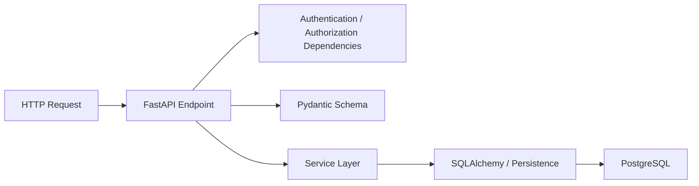

# Akahalu Portfolio — Backend Architecture

## 1. Overview

The Akahalu Portfolio backend is an asynchronous FastAPI application responsible for:

* public portfolio APIs;
* administrative APIs;
* authentication;
* authorization;
* account lifecycle management;
* portfolio data management;
* contact inquiry management;
* persistent storage;
* application health and readiness.

The backend is implemented with Python 3.13 and follows a layered architecture intended to separate HTTP concerns, validation, business logic, persistence, and infrastructure.

---

## 2. Technology Stack

Primary backend technologies include:

```text
Python 3.13
FastAPI
Pydantic
SQLAlchemy 2
Alembic
PostgreSQL
Redis
psycopg
PyJWT
pwdlib / Argon2
structlog
pytest
pytest-asyncio
Ruff
mypy
uv
```

Dependency versions are locked through:

```text
backend/uv.lock
```

The backend environment is managed with `uv`.

---

## 3. Source Structure

The main backend application resides under:

```text
backend/app/
```

Important architectural areas include:

```text
app/
├── api/
│   ├── router.py
│   └── v1/
│       ├── router.py
│       └── endpoints/
├── core/
├── db/
├── models/
├── schemas/
├── services/
└── main.py
```

Supporting infrastructure includes:

```text
backend/
├── migrations/
├── scripts/
├── tests/
├── alembic.ini
├── pyproject.toml
└── uv.lock
```

---

## 4. Request Flow

A typical backend operation follows this logical direction:



The exact internal path varies by domain, but responsibilities should remain separated.

---

## 5. API Layer

The API layer is responsible for:

* HTTP routing;
* request parsing;
* Pydantic request/response contracts;
* dependency injection;
* authentication checks;
* permission checks;
* HTTP status mapping;
* response serialization.

Application routes are versioned below:

```text
/api/v1
```

The version router is composed through:

```text
app/api/router.py
app/api/v1/router.py
```

Domain endpoints should avoid embedding persistence implementation details directly into HTTP handlers where those responsibilities belong in service/data layers.

---

## 6. Schema Layer

Pydantic schemas define API contracts.

They are used for:

* input validation;
* normalization;
* response serialization;
* enumeration validation;
* field-level constraints;
* optional/required update semantics;
* API contract separation from SQLAlchemy models.

Portfolio schemas are organized by domain, including:

```text
profile
project
project category
technology
experience
contact inquiry
identity-related contracts
```

Schemas should remain independent of direct HTTP request handling wherever practical.

---

## 7. Service Layer

Services implement application and business rules.

Typical responsibilities include:

* duplicate detection;
* normalization;
* status transitions;
* soft deletion;
* restoration;
* visibility control;
* publication rules;
* relationship validation;
* role and permission synchronization;
* account lifecycle behavior.

Service-specific exceptions are translated into appropriate HTTP responses by the API layer.

This avoids coupling domain behavior directly to transport semantics.

---

## 8. Persistence

The backend uses SQLAlchemy 2 with asynchronous database sessions.

Database infrastructure resides under:

```text
app/db/
```

Key responsibilities include:

* declarative base configuration;
* asynchronous session creation;
* database dependencies;
* model registration.

Database sessions are provided to API operations through FastAPI dependency injection.

PostgreSQL is the authoritative relational datastore.

---

## 9. Model Registry

SQLAlchemy metadata must contain all application models before operations such as:

* migrations;
* test schema creation;
* metadata inspection.

The project maintains an explicit model registry to ensure domain models are registered consistently.

This is especially important for:

```text
Base.metadata
```

used by Alembic and integration-test infrastructure.

---

## 10. Authentication

The authentication system supports:

* password login;
* Argon2 password hashing;
* short-lived access tokens;
* refresh tokens;
* session tracking;
* refresh-token rotation;
* refresh-token reuse detection;
* session revocation;
* logout;
* logout of other sessions;
* password changes;
* password-reset tokens;
* email-verification lifecycle.

JWT configuration includes:

```text
JWT_SECRET_KEY
JWT_ALGORITHM
JWT_ISSUER
JWT_AUDIENCE
ACCESS_TOKEN_EXPIRE_MINUTES
REFRESH_TOKEN_EXPIRE_DAYS
```

Production JWT secrets must be generated independently from development secrets.

---

## 11. Authorization

Authorization is permission-based.

Endpoint guards use permission dependencies such as:

```text
require_permission(...)
require_any_permission(...)
```

The current production identity bootstrap synchronizes 17 required permissions.

Permission families include:

```text
projects.*
profile.*
experience.*
contact_inquiries.*
users.manage
roles.manage
```

The system roles are:

```text
super_admin
admin
editor
viewer
```

Super administrators retain a privileged authorization path, while standard roles receive explicit permission assignments.

Authorization logic belongs on the backend and cannot rely solely on frontend navigation visibility.

---

## 12. Account and Session Security

The authentication domain includes defensive controls for:

* failed-login tracking;
* account lockout;
* password history;
* active sessions;
* refresh token revocation;
* token replay/reuse detection;
* account lifecycle token expiry.

Frontend behavior may hide or disable unavailable actions, but backend authorization remains authoritative.

---

## 13. Portfolio Domains

### Profile

Provides public profile presentation and protected profile administration.

### Projects

Supports:

* public project listings;
* project details;
* featured projects;
* publication state;
* visibility;
* administration;
* related technologies;
* related categories;
* project links;
* project media.

### Categories

Supports:

* public listings;
* admin CRUD;
* active/inactive state;
* soft deletion;
* restoration;
* assignment protection.

### Technologies

Supports:

* public listings;
* admin CRUD;
* technology categorization;
* validation;
* active state;
* soft deletion;
* restoration;
* assigned-project protection.

### Experience

Supports:

* public experience;
* featured experience;
* administrative CRUD;
* visibility;
* soft deletion/restoration.

### Contact inquiries

Supports:

* public submissions;
* administrative review;
* statuses;
* read state;
* assignment;
* soft deletion/restoration;
* statistics.

---

## 14. Soft Deletion

Administrative domains use soft deletion where historical retention is appropriate.

Typical records maintain:

```text
deleted_at
```

rather than being immediately destroyed.

Service behavior controls:

* deletion;
* restoration;
* whether deleted content can appear publicly;
* whether relationships prevent deletion.

Public APIs exclude deleted records.

---

## 15. Public Visibility

Public endpoints must apply visibility rules at the backend data-access level.

Frontend filtering is not sufficient for security or privacy.

Examples include:

* private portfolio profile data;
* unpublished projects;
* hidden experiences;
* deleted categories;
* inactive/deleted technologies.

The backend determines whether records are eligible for public responses.

---

## 16. Migrations

Alembic manages relational schema evolution.

Configuration:

```text
backend/alembic.ini
backend/migrations/env.py
backend/migrations/versions/
```

`migrations/env.py` obtains its database URL from application settings rather than relying on the placeholder URL in `alembic.ini`.

The validated migration head is:

```text
17f167659ec9
```

A production deployment runs:

```text
alembic upgrade head
```

as a separate one-time deployment job.

Migrations are not automatically executed by every FastAPI worker.

---

## 17. Identity Bootstrap

After successful migrations, production synchronizes required roles and permissions with:

```text
python -m scripts.seed_identity --skip-admin
```

The bootstrap:

* synchronizes 17 permissions;
* synchronizes system roles;
* does not require interactive administrator creation;
* can safely run as a controlled deployment bootstrap step.

The first production administrator is created separately.

---

## 18. Configuration

Backend settings are managed through:

```text
app/core/config.py
```

Pydantic settings validate runtime configuration.

Production hardening rejects unsafe configuration including:

* `DEBUG=true`;
* wildcard CORS;
* empty CORS configuration;
* inappropriate localhost production origins;
* wildcard trusted hosts.

API documentation defaults to disabled in production.

---

## 19. Health Endpoints

### General health

```text
GET /api/v1/health
```

### Liveness

```text
GET /api/v1/health/live
```

Liveness confirms the application process is alive.

### Readiness

```text
GET /api/v1/health/ready
```

Readiness validates dependencies including:

```text
PostgreSQL
Redis
```

Dependency failure causes readiness to return an unhealthy result rather than advertising the backend as ready for traffic.

---

## 20. Testing Architecture

Tests are located under:

```text
backend/tests/
```

The integration-test infrastructure requires:

```text
TEST_DATABASE_URL
```

with:

```text
database = portfolio_test_db
username = portfolio_user
```

The session-level test fixture:

1. connects to the dedicated test database;
2. drops existing application metadata;
3. creates the required `citext` extension;
4. creates application tables;
5. runs tests within controlled transactions;
6. drops test metadata at session completion.

The current CI test environment requires PostgreSQL but not a separate Redis service.

---

## 21. Quality Gates

Backend validation includes:

```text
uv run ruff check app scripts tests
uv run mypy app scripts tests
uv run pytest -q
```

CI additionally verifies:

```text
exactly one Alembic head
fresh PostgreSQL migration to head
```

This prevents schema divergence and catches migration failures before deployment.

---

## 22. Production Container

The backend production image is defined by:

```text
infrastructure/docker/backend.Dockerfile
```

Important characteristics include:

* Python 3.13 slim base;
* locked `uv` dependency installation;
* production dependencies only;
* local source copied after dependency installation;
* application executed as non-root `appuser`;
* readiness healthcheck;
* Uvicorn listening internally on port `8000`.

The backend container is not directly published to the production host.

---

## 23. Logging and Observability

The backend includes structured logging support through `structlog`.

Production observability should continue to evolve around:

* application logs;
* HTTP error rates;
* readiness failures;
* authentication security events;
* database connectivity;
* migration failures;
* Redis availability.

External monitoring and centralized log aggregation remain deployment-stage concerns rather than assumptions embedded into application code.

---

## 24. Backend Design Principles

Backend changes should preserve the following principles:

1. Business rules should not be duplicated across endpoints.
2. Authorization must be enforced server-side.
3. Public visibility must be enforced in backend queries/services.
4. API inputs and outputs should use explicit schemas.
5. Database schema changes require Alembic migrations.
6. Tests must use the dedicated test database.
7. Secrets must not be committed.
8. Production startup must not automatically publish development content.
9. API documentation remains disabled in production unless explicitly enabled.
10. Migrations and bootstrap operations remain controlled deployment tasks.
