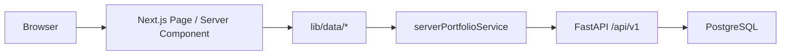
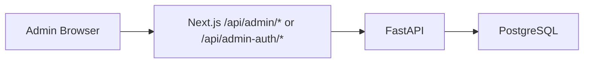

# Akahalu Portfolio — Frontend Architecture

## 1. Overview

The Akahalu Portfolio frontend is a Next.js App Router application responsible for:

* the public portfolio website;
* protected administration interfaces;
* server-side portfolio data retrieval;
* administration BFF routes;
* authentication/session coordination;
* responsive presentation;
* production standalone deployment.

The frontend is designed so that browser code does not need direct access to backend bearer tokens.

---

## 2. Technology Stack

The frontend currently uses:

```text
Next.js 16.2.12
React 19.2.4
TypeScript
Tailwind CSS 4
shadcn UI
TanStack Query
Axios
Zod
lucide-react
react-icons
pnpm 11.18.0
```

The package manager is explicitly pinned in:

```text
frontend/package.json
```

with:

```text
pnpm@11.18.0
```

---

## 3. Application Surfaces

The frontend contains two main surfaces.

### Public website

Examples include:

```text
/
/about
/projects
/projects/[slug]
/experience
/contact
```

### Protected administration

Examples include:

```text
/admin
/admin/profile
/admin/projects
/admin/projects/new
/admin/projects/[projectId]
/admin/categories
/admin/technologies
/admin/experience
/admin/inquiries
/admin/users
```

Authentication routes include:

```text
/admin/login
/admin/forgot-password
/admin/reset-password
```

---

## 4. App Router Structure

Routes are organized using Next.js route groups.

Conceptually:

```text
app/
├── (site)/
├── (admin)/
└── api/
```

Route groups separate public and administrative layout concerns without altering their public URL paths.

---

## 5. Public Data Flow

Public server-rendered data is retrieved through server-only portfolio services.

A typical flow is:



Server-side calls use the internal backend configuration rather than depending only on a browser-visible URL.

---

## 6. Server Environment Boundary

Server-only backend configuration is centralized through:

```text
frontend/config/server-env.ts
```

Server communication prefers:

```text
BACKEND_API_URL
```

Production example:

```text
http://backend:8000/api/v1
```

This address is available inside the Docker network and is not exposed to browser JavaScript.

---

## 7. Public Environment Variables

Browser-visible environment configuration uses `NEXT_PUBLIC_*` variables.

Examples include:

```text
NEXT_PUBLIC_APP_URL
NEXT_PUBLIC_API_URL
NEXT_PUBLIC_API_TIMEOUT_MS
```

Values beginning with `NEXT_PUBLIC_` may become part of the browser build and must never contain secrets.

The frontend therefore maintains a strict distinction:

```text
NEXT_PUBLIC_*     browser-safe configuration
BACKEND_API_URL  server-only configuration
```

---

## 8. Admin BFF Architecture

Protected administration uses a Backend-for-Frontend pattern.

The browser does not need to communicate directly with FastAPI using raw backend bearer credentials.

Instead:



Examples include:

```text
/api/admin-auth/login
/api/admin-auth/logout
/api/admin-auth/refresh
/api/admin-auth/session

/api/admin/profile
/api/admin/projects
/api/admin/categories
/api/admin/technologies
/api/admin/experiences
/api/admin/inquiries
/api/admin/users
```

These routes belong to Next.js even though they begin with `/api`.

Nginx therefore routes only:

```text
/api/v1/*
```

directly to FastAPI.

All `/api/admin/*` and `/api/admin-auth/*` requests continue to Next.js.

---

## 9. Authentication Boundary

The frontend coordinates authenticated administrative sessions while FastAPI remains authoritative for identity and authorization.

Responsibilities are separated as follows.

### Next.js

* browser-facing session transport;
* authentication BFF requests;
* protected navigation;
* server-side authentication checks;
* client request coordination.

### FastAPI

* credential validation;
* JWT creation;
* refresh-token validation;
* session persistence;
* replay/reuse detection;
* authorization;
* user status enforcement.

Frontend access control improves user experience, but it does not replace backend permission enforcement.

---

## 10. Refresh Coordination

Admin authentication includes refresh coordination to prevent same-runtime refresh races.

The frontend uses a shared in-flight refresh promise so concurrent requests in the same browser runtime can join one refresh operation rather than independently attempting refresh-token rotation.

The protection applies to the same runtime/tab execution context.

Backend reuse detection remains necessary because multiple tabs, browsers, devices, or processes can still act independently.

---

## 11. Public Build Resilience

The frontend production build is intentionally independent from a live FastAPI process.

Public data loaders provide safe fallback states where appropriate.

Examples include:

* homepage profile fallback;
* empty featured projects;
* empty featured experiences;
* unavailable profile state;
* empty project directory;
* empty experience directory.

This allows:

```text
pnpm build
```

to complete even when FastAPI is unavailable.

The behavior has been validated with port `8000` offline.

The result still generated all production routes and:

```text
.next/standalone
```

successfully.

---

## 12. Rendering Strategy

The application uses a mixture of static, revalidated, and dynamic routes depending on data requirements.

Validated examples include revalidated public pages such as:

```text
/
/about
/contact
```

and server-rendered routes including:

```text
/projects
/projects/[slug]
/experience
```

Administrative dynamic behavior is handled through a combination of server rendering, client components, and BFF route handlers.

Rendering strategy should remain driven by data correctness and user experience rather than forcing every route into one rendering mode.

---

## 13. Homepage Fallback

The homepage includes safe fallback identity content so temporary backend unavailability during build does not prevent the site image from being created.

When public profile data is available, backend data replaces the fallback values.

When unavailable, the page remains renderable.

Featured projects and experiences similarly degrade to empty states.

---

## 14. About Page Fallback

The About page loads the public profile through the shared profile data loader.

When profile data is unavailable:

* metadata falls back to safe static values;
* the page renders an unavailable-profile state;
* the production build continues.

This is preferable to coupling container-image creation to a running production database/API.

---

## 15. Frontend Service Separation

Portfolio services are separated between client-safe and server-only concerns.

Server-only implementations use:

```text
import "server-only"
```

where appropriate.

This prevents internal backend configuration from being accidentally imported into browser bundles.

---

## 16. Production Build

Production configuration includes:

```text
output: "standalone"
poweredByHeader: false
```

A production build is created with:

```text
pnpm build
```

The standalone output is located at:

```text
.next/standalone
```

Static assets are located at:

```text
.next/static
```

Public assets remain under:

```text
public/
```

---

## 17. Production Container

The frontend image is defined by:

```text
infrastructure/docker/frontend.Dockerfile
```

The image uses a multi-stage build.

Conceptually:

```text
Node base
   ↓
pnpm dependency installation
   ↓
Next.js build
   ↓
minimal standalone runtime
```

The runtime container:

* contains standalone output;
* contains Next.js static assets;
* contains public assets;
* runs as the non-root `nextjs` user;
* listens internally on port `3000`;
* exposes a frontend health endpoint.

---

## 18. Frontend Health Endpoint

The application provides:

```text
GET /api/health
```

The endpoint verifies the Next.js process independently from FastAPI.

This allows container orchestration to distinguish:

```text
frontend unavailable
```

from:

```text
backend dependency unavailable
```

---

## 19. pnpm Supply-Chain Policy

pnpm dependency installation uses an explicit build-script allowlist.

Current approved native dependency builds are defined in:

```text
frontend/pnpm-workspace.yaml
```

for:

```text
sharp@0.34.5
unrs-resolver@1.12.2
```

New dependencies requiring install/build scripts must be reviewed explicitly rather than globally allowing arbitrary dependency scripts.

---

## 20. Frontend CI

Frontend GitHub Actions validates:

```text
pnpm install --frozen-lockfile
pnpm lint
pnpm exec tsc --noEmit
pnpm build
```

The workflow also confirms:

```text
.next/standalone
```

exists.

CI intentionally does not start FastAPI.

This ensures a future frontend change cannot accidentally reintroduce a backend dependency into image creation without failing CI.

---

## 21. Nginx Routing

Production Nginx routing is intentionally simple:

```text
/api/v1/*   → FastAPI
everything else → Next.js
```

Therefore:

```text
/api/admin/*
/api/admin-auth/*
```

remain within the Next.js BFF.

Static Next.js assets under:

```text
/_next/static/
```

are proxied to Next.js with long-lived immutable caching.

---

## 22. Public Empty States

Public UI components provide meaningful empty states rather than exposing backend errors directly.

Examples include:

* projects coming soon;
* experience unavailable;
* profile unavailable.

Empty states should remain distinguishable from authorization errors in protected administration.

---

## 23. Administration Design

Admin pages should maintain the following boundaries:

1. Browser components communicate through frontend services/BFF routes.
2. Backend bearer credentials are not exposed directly to client code.
3. UI permission visibility is not treated as authorization.
4. FastAPI remains authoritative.
5. Administrative mutations should surface backend validation rather than recreate conflicting rules in the frontend.

---

## 24. Type Safety

TypeScript types represent portfolio and administrative contracts.

Frontend data handling should preserve consistency between:

* FastAPI response schemas;
* frontend TypeScript interfaces/types;
* service return values;
* page/component expectations.

When backend API contracts change, related frontend types and service methods should be updated in the same feature scope.

---

## 25. Error Handling

Frontend error handling distinguishes among:

* missing public content;
* backend unavailability;
* authentication expiry;
* authorization denial;
* validation failures;
* unknown application failures.

Public pages favor safe fallback states where doing so preserves correct semantics.

Administrative operations should surface actionable failures rather than silently degrading.

---

## 26. Frontend Design Principles

Frontend changes should preserve the following principles:

1. Do not expose backend secrets or raw bearer tokens unnecessarily.
2. Keep `BACKEND_API_URL` server-only.
3. Treat `NEXT_PUBLIC_*` variables as public.
4. Keep admin BFF routes under Next.js.
5. Preserve backend-independent production builds.
6. Preserve explicit pnpm build-script approval.
7. Use backend permissions as the authoritative access-control source.
8. Maintain typed contracts.
9. Keep public error states graceful.
10. Validate with lint, TypeScript, and production build before release.
