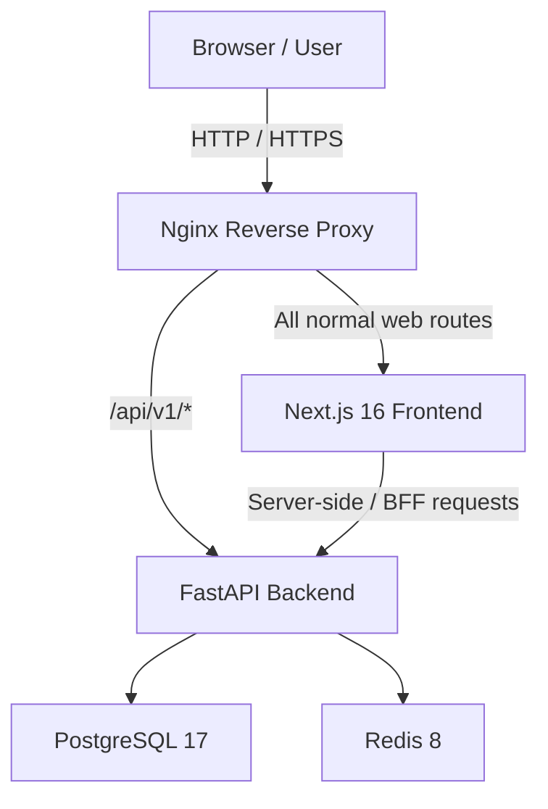
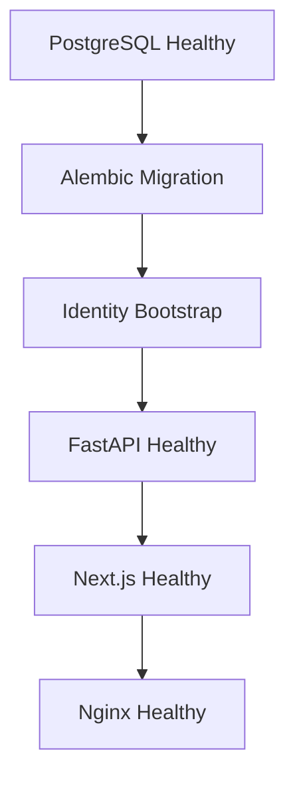

# Akahalu Portfolio — System Overview

## 1. Purpose

Akahalu Portfolio is a full-stack personal portfolio and administration platform designed to present professional profile information, projects, technologies, categories, experience, and contact information while providing a protected administration interface for managing that content.

The system is designed around clear separation between:

* public portfolio presentation;
* protected administration;
* backend business logic;
* persistent application data;
* authentication and authorization;
* deployment infrastructure;
* continuous integration and validation.

The production architecture uses Next.js for the web application, FastAPI for the backend API, PostgreSQL for persistent relational data, Redis for supporting application infrastructure, and Nginx as the public reverse proxy.

---

## 2. High-Level Architecture



In production, only Nginx is intended to accept public traffic.

PostgreSQL, Redis, FastAPI, and Next.js remain internal Docker services.

---

## 3. Major Components

### 3.1 Nginx

Nginx is the public reverse proxy and network entry point.

Production responsibilities include:

* receiving web traffic;
* forwarding `/api/v1/*` requests to FastAPI;
* forwarding all other application routes to Next.js;
* preserving the Next.js BFF routes under `/api/admin/*` and `/api/admin-auth/*`;
* forwarding proxy headers;
* applying security response headers;
* serving as the future TLS termination layer;
* preventing direct public exposure of PostgreSQL, Redis, FastAPI, and Next.js.

Validated security headers include:

* `X-Content-Type-Options: nosniff`
* `X-Frame-Options: SAMEORIGIN`
* `Referrer-Policy: strict-origin-when-cross-origin`
* `Permissions-Policy: camera=(), microphone=(), geolocation=()`

The proxy exposes a lightweight `/healthz` endpoint for infrastructure health verification.

---

## 4. Frontend

The frontend is implemented with:

* Next.js 16.2.12;
* React 19.2.4;
* TypeScript;
* Tailwind CSS 4;
* shadcn-based UI components;
* TanStack Query;
* Axios;
* Zod;
* pnpm 11.18.0.

The frontend serves two primary application surfaces:

1. the public portfolio;
2. the protected administration interface.

The production build uses:

```text
output: "standalone"
```

in `frontend/next.config.ts`.

This produces a minimal standalone Next.js runtime suitable for container deployment.

The production container runs as the non-root `nextjs` user.

---

## 5. Backend

The backend is implemented with:

* Python 3.13;
* FastAPI;
* SQLAlchemy 2 asynchronous sessions;
* PostgreSQL;
* Redis;
* Pydantic;
* Alembic;
* JWT-based authentication;
* Argon2 password hashing;
* role-based authorization.

The API is versioned beneath:

```text
/api/v1
```

The backend production container runs as the non-root `appuser` user.

API documentation is enabled for development environments but disabled by default in production.

Production verification confirms both:

```text
/docs
/openapi.json
```

return `404`.

---

## 6. Application Domains

The platform currently supports the following primary domains.

### Public portfolio

* profile;
* projects;
* project categories;
* technologies;
* experience;
* public contact functionality.

### Administration

* profile management;
* project management;
* category management;
* technology management;
* experience management;
* contact inquiry management;
* user management;
* authentication and account lifecycle.

### Identity and access management

* users;
* roles;
* permissions;
* login;
* access tokens;
* refresh tokens;
* sessions;
* account lifecycle tokens;
* role-based authorization.

---

## 7. Data Layer

PostgreSQL is the authoritative persistent datastore.

The production database is initialized through Alembic migrations rather than application startup-time table creation.

The current migration chain is:

```text
616a4a5910c3
    ↓
1d1a0aa75236
    ↓
fc710990420c
    ↓
e518f89e76f5
    ↓
291b9552d692
    ↓
a7e354695851
    ↓
17f167659ec9
```

Current Alembic head:

```text
17f167659ec9
```

The project maintains exactly one Alembic migration head.

---

## 8. Redis

Redis is available to the backend as an internal infrastructure dependency.

The production Redis instance:

* is not published to the host;
* is reachable through the private Docker network;
* uses password authentication in the production Compose configuration;
* uses persistent storage;
* participates in backend readiness verification.

The current automated backend test suite does not require a separate Redis service in CI.

---

## 9. Production Network Boundaries

The validated production Docker topology exposes only Nginx.

Example local production-stack exposure:

```text
127.0.0.1:8080 → nginx:80
```

Internal services remain unexposed:

```text
backend:8000
frontend:3000
postgres:5432
redis:6379
```

This prevents database and internal application services from becoming public entry points.

---

## 10. Production Startup Order

The production Compose stack coordinates startup using health and completion conditions.

The intended sequence is:



The migration and identity-bootstrap services are one-time jobs.

Expected state after startup:

```text
postgres             healthy
redis                healthy
migrate              exited (0)
identity-bootstrap   exited (0)
backend              healthy
frontend             healthy
nginx                healthy
```

---

## 11. Identity Bootstrap

Fresh environments use:

```text
python -m scripts.seed_identity --skip-admin
```

to synchronize the system permission and role catalog.

The currently validated bootstrap contains 17 permissions across:

* projects;
* profile;
* experience;
* contact inquiries;
* users;
* roles.

System roles are:

* `super_admin`;
* `admin`;
* `editor`;
* `viewer`.

The identity bootstrap is idempotent and is run after migrations.

Administrator credentials are not baked into the production image or Compose configuration.

Creation of the initial super administrator remains an explicit one-time administrative operation.

---

## 12. Portfolio Seed Policy

`backend/scripts/seed_portfolio.py` contains development/personal portfolio content.

It is not an automatic production startup task.

Production portfolio content should be populated through:

* the administration interface;
* reviewed API operations;
* or an explicitly approved one-time seed execution.

This prevents application deployment from silently publishing development content.

---

## 13. Health Model

### Nginx

```text
GET /healthz
```

Confirms the reverse proxy is running.

### Next.js

```text
GET /api/health
```

Confirms the frontend runtime is available.

### FastAPI liveness

```text
GET /api/v1/health/live
```

Confirms the backend process is alive.

### FastAPI readiness

```text
GET /api/v1/health/ready
```

Verifies backend readiness and checks dependencies including:

* PostgreSQL;
* Redis.

A backend process may therefore be alive without necessarily being ready to receive production traffic.

---

## 14. Environment Configuration

Configuration is separated by application boundary.

### Backend development

```text
backend/.env
backend/.env.example
```

### Frontend development

```text
frontend/.env.local
frontend/.env.example
```

### Production infrastructure

```text
infrastructure/production.env
infrastructure/production.env.example
```

The real production environment file is ignored by Git.

Secrets must never be committed to source control.

Production secrets include, among others:

* PostgreSQL password;
* Redis password;
* JWT secret;
* contact hash secret.

Production credentials must be independently generated and must not reuse development credentials.

---

## 15. Frontend/Backend URL Model

Browser-visible and internal backend URLs are intentionally separate.

### Browser/public API

```text
https://<domain>/api/v1
```

### Internal Next.js-to-FastAPI communication

```text
http://backend:8000/api/v1
```

The frontend uses `BACKEND_API_URL` for server-side and BFF communication.

Public `NEXT_PUBLIC_*` variables are reserved for values that may be exposed to browser code.

---

## 16. Continuous Integration

The repository contains independent GitHub Actions workflows for backend and frontend validation.

### Backend CI

Backend CI validates:

```text
uv sync
Ruff
mypy
single Alembic head
fresh PostgreSQL migration
pytest
```

PostgreSQL 17 is provisioned as a GitHub Actions service container.

### Frontend CI

Frontend CI validates:

```text
pnpm install --frozen-lockfile
ESLint
TypeScript
Next.js production build
standalone output
```

The frontend CI build intentionally runs without a FastAPI server.

This ensures the frontend production build does not accidentally become dependent on a live backend.

Both workflows were successfully validated remotely on the project repository.

---

## 17. Deployment Principle

The deployment architecture follows these core rules:

1. Only the reverse proxy is publicly exposed.
2. Application containers run as non-root users.
3. Database and Redis services remain private.
4. Migrations execute as a controlled one-time deployment job.
5. Identity bootstrap executes after successful migrations.
6. Secrets are external to source control and container images.
7. Frontend builds do not require a live backend.
8. API documentation is disabled in production by default.
9. CI validates backend and frontend independently.
10. Production content seeding is explicit rather than automatic.

---

## 18. Current Deployment Readiness

The following infrastructure has been validated:

* production-aware backend configuration;
* trusted-host validation;
* CORS production validation;
* production API documentation suppression;
* Next.js standalone builds;
* backend-independent frontend builds;
* non-root application containers;
* PostgreSQL production container;
* authenticated Redis production container;
* Alembic fresh-database migration;
* identity bootstrap;
* Nginx reverse proxy;
* production health checks;
* security headers;
* private service networking;
* GitHub Actions backend CI;
* GitHub Actions frontend CI.

Hosting provider selection, TLS/domain configuration, production backups, monitoring, and final public release remain separate deployment activities.
