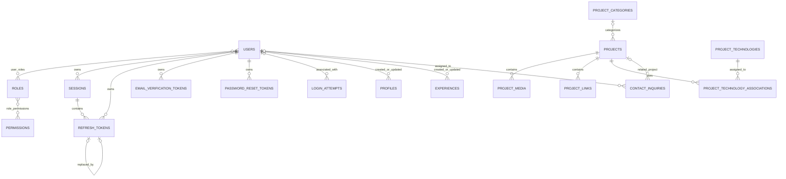

# Akahalu Portfolio — Database Data Model

## 1. Overview

Akahalu Portfolio uses PostgreSQL as its authoritative relational datastore.

The database supports four main areas:

1. identity and role-based access control;
2. authentication and account lifecycle;
3. portfolio content;
4. contact inquiry management.

SQLAlchemy 2 models define the application-side data model, while Alembic migrations define the production schema history.

The authoritative SQLAlchemy metadata registry is:

```text
backend/app/db/model_registry.py
```

All models required by Alembic and metadata-driven operations must be imported by this registry.

---

## 2. PostgreSQL Extensions

The PostgreSQL initialization script enables:

```sql
CREATE EXTENSION IF NOT EXISTS "uuid-ossp";
CREATE EXTENSION IF NOT EXISTS "pgcrypto";
CREATE EXTENSION IF NOT EXISTS "citext";
```

These are configured in:

```text
infrastructure/postgres/init.sql
```

`CITEXT` is used for selected case-insensitive fields including:

* user email;
* profile primary email;
* project slugs;
* experience slugs;
* project category names and slugs;
* project technology names and slugs;
* contact inquiry email.

---

# 3. Shared Model Conventions

Most application entities inherit from:

```text
BaseModel
```

defined in:

```text
backend/app/db/base.py
```

`BaseModel` combines:

```text
UUIDPrimaryKeyMixin
TimestampMixin
SoftDeleteMixin
TableNameMixin
```

---

## 3.1 UUID primary keys

Most entity tables use:

```text
id UUID PRIMARY KEY
```

with UUID values generated by the application.

This provides stable non-sequential identifiers suitable for API exposure.

---

## 3.2 Timestamps

Most application tables include:

```text
created_at
updated_at
```

Both are timezone-aware timestamps.

`created_at` receives a database default of the current time.

`updated_at` is maintained when model updates occur.

---

## 3.3 Soft deletion

Most entity tables contain:

```text
deleted_at
```

A record is considered active when:

```text
deleted_at IS NULL
```

The shared model exposes:

```python
soft_delete()
restore()
is_deleted
```

Soft deletion is particularly important for:

* users;
* roles;
* permissions;
* portfolio profile;
* projects;
* categories;
* technologies;
* project media;
* project links;
* project-technology assignments;
* experience;
* contact inquiries;
* authentication-related records.

Public-facing queries must not treat soft-deleted records as visible content.

---

## 3.4 Constraint naming

The metadata layer uses a deterministic naming convention:

```text
ix_<table>_<column>
uq_<table>_<column>
ck_<table>_<constraint>
fk_<table>_<column>_<referenced-table>
pk_<table>
```

This keeps Alembic-generated database objects predictable.

---

# 4. High-Level Entity Relationships



---

# 5. Identity and Access Control

## 5.1 `users`

Model:

```text
backend/app/models/user.py
```

Purpose:

* administrative identities;
* authentication state;
* account lockout state;
* verification state;
* role membership.

Important fields include:

```text
email
password_hash
first_name
last_name
display_name
avatar_url

is_active
is_verified
is_superuser

failed_login_attempts
locked_until
last_login_at
password_changed_at
```

### Important rules

`email` uses PostgreSQL `CITEXT` and is unique.

This means email uniqueness is case-insensitive at the database level.

User deletion is soft deletion through `deleted_at`.

---

## 5.2 `roles`

Model:

```text
backend/app/models/role.py
```

Important fields:

```text
name
display_name
description
is_system
is_active
```

`name` is unique.

`is_system` distinguishes built-in roles from ordinary role records.

---

## 5.3 `permissions`

Model:

```text
backend/app/models/permission.py
```

Important fields:

```text
code
name
description
is_active
```

`code` is unique and is the value used by backend authorization checks.

Examples include:

```text
projects.read
projects.create
projects.update
projects.delete

profile.read
profile.create
profile.update
profile.delete

experience.read
experience.create
experience.update
experience.delete

contact_inquiries.read
contact_inquiries.update
contact_inquiries.delete

users.manage
roles.manage
```

The production identity bootstrap is responsible for synchronizing the current permission catalogue.

---

## 5.4 `user_roles`

This is a many-to-many association table between:

```text
users
roles
```

Composite primary key:

```text
user_id
role_id
```

Both foreign keys use:

```text
ON DELETE CASCADE
```

Deleting a user or role therefore removes the corresponding association rows.

---

## 5.5 `role_permissions`

Many-to-many association between:

```text
roles
permissions
```

Composite primary key:

```text
role_id
permission_id
```

Both foreign keys use:

```text
ON DELETE CASCADE
```

---

# 6. Authentication and Session Domain

## 6.1 `sessions`

Model:

```text
backend/app/models/session.py
```

A session represents a logged-in device/browser context.

Important fields:

```text
user_id
user_agent
ip_address
device_name
last_seen_at
expires_at
revoked_at
revocation_reason
is_active
```

Relationship:

```text
users 1 → many sessions
```

The user foreign key uses:

```text
ON DELETE CASCADE
```

A session can own multiple refresh tokens.

---

## 6.2 `refresh_tokens`

Model:

```text
backend/app/models/refresh_token.py
```

The database stores token digests rather than raw refresh-token values.

Important fields:

```text
user_id
session_id
token_digest
family_id
expires_at
used_at
revoked_at
replaced_by_token_id
```

`token_digest` is unique.

`family_id` groups rotated tokens belonging to the same token family.

`replaced_by_token_id` is a self-referencing foreign key that records rotation lineage.

Relationships:

```text
User    1 → many RefreshToken
Session 1 → many RefreshToken
```

Deletion of the owning user or session cascades to refresh-token rows.

The replacement reference uses:

```text
ON DELETE SET NULL
```

---

## 6.3 `login_attempts`

Model:

```text
backend/app/models/login_attempt.py
```

Records authentication attempts.

Important fields:

```text
user_id
email
ip_address
user_agent
was_successful
failure_reason
```

`user_id` may be null because login attempts can occur for an email that does not resolve to a user.

The user relationship uses:

```text
ON DELETE SET NULL
```

This allows security-event history to survive user deletion.

---

# 7. Account Lifecycle Tokens

## 7.1 `email_verification_tokens`

Model:

```text
backend/app/models/email_verification_token.py
```

Important fields:

```text
user_id
token_digest
expires_at
consumed_at
revoked_at
```

The raw token is not represented by the model; the stored value is a digest.

`token_digest` is unique.

Database constraint:

```text
expires_at > created_at
```

A token is usable only when it is:

* not consumed;
* not revoked;
* not expired.

User deletion cascades to verification tokens.

---

## 7.2 `password_reset_tokens`

Model:

```text
backend/app/models/password_reset_token.py
```

Fields and lifecycle closely parallel email-verification tokens:

```text
user_id
token_digest
expires_at
consumed_at
revoked_at
```

The database requires:

```text
expires_at > created_at
```

User deletion cascades to reset tokens.

---

# 8. Portfolio Profile

## 8.1 `profiles`

Model:

```text
backend/app/models/profile.py
```

The application is designed around a singleton professional profile.

The record uses:

```text
profile_key = 'primary'
```

and the column is unique.

This prevents multiple profile records, including accidental duplicate primary profiles.

Important content fields:

```text
first_name
middle_name
last_name
display_name

professional_title
headline
short_bio
biography

location
country
timezone

primary_email
phone

website_url
resume_url
profile_image_url

years_of_experience

availability_status
availability_message

is_public

seo_title
seo_description
```

Audit references:

```text
created_by_id → users.id
updated_by_id → users.id
```

Both use:

```text
ON DELETE SET NULL
```

so portfolio content survives removal of the administrator that created or updated it.

### Availability states

Allowed values are:

```text
available
open_to_opportunities
limited_availability
unavailable
```

### Public visibility

Public profile eligibility requires:

```text
deleted_at IS NULL
AND is_public = true
```

A partial index supports this access pattern.

---

# 9. Project Categories

## 9.1 `project_categories`

Model:

```text
backend/app/models/project_category.py
```

Important fields:

```text
name
slug
description
icon
color
is_active
sort_order
seo_title
seo_description
```

`name` and `slug` use `CITEXT` and are unique.

This protects against case-only duplicates.

Color, when present, must match:

```text
#RRGGBB
```

`sort_order` must be non-negative.

### Relationship

```text
ProjectCategory 1 → many Project
```

Projects reference the category with:

```text
ON DELETE RESTRICT
```

A category therefore cannot be physically removed while projects still depend on it.

---

# 10. Project Technologies

## 10.1 `project_technologies`

Model:

```text
backend/app/models/project_technology.py
```

Important fields:

```text
name
slug
description
category
icon
official_url
color
is_active
sort_order
```

`name` and `slug` use `CITEXT` and are unique.

### Allowed categories

```text
language
framework
library
database
platform
cloud
devops
testing
tool
service
other
```

`sort_order` must be non-negative.

Color must be a valid six-digit hexadecimal value when provided.

Public availability requires:

```text
deleted_at IS NULL
AND is_active = true
```

---

# 11. Projects

## 11.1 `projects`

Model:

```text
backend/app/models/project.py
```

Projects contain the main portfolio case-study content.

Important fields:

```text
title
slug
short_description
description

problem_statement
solution_summary
key_features
technical_highlights

category_id

status
visibility
is_featured
sort_order

repository_url
live_url
case_study_url
thumbnail_url

started_at
completed_at
published_at

seo_title
seo_description

created_by_id
updated_by_id
```

`slug` uses `CITEXT` and is unique.

### Project status

Allowed values:

```text
draft
published
archived
```

### Visibility

Allowed values:

```text
public
private
unlisted
```

### Publication invariant

A published project must have:

```text
published_at IS NOT NULL
```

The database enforces:

```text
status <> 'published'
OR published_at IS NOT NULL
```

### Date rule

When both dates exist:

```text
completed_at >= started_at
```

### Public eligibility

A public project must satisfy:

```text
deleted_at IS NULL
AND status = 'published'
AND visibility = 'public'
AND published_at IS NOT NULL
```

A dedicated partial index supports this query pattern.

### Audit references

```text
created_by_id → users.id
updated_by_id → users.id
```

Both use `ON DELETE SET NULL`.

---

# 12. Project-Technology Associations

## 12.1 `project_technology_associations`

Model:

```text
backend/app/models/project_associations.py
```

This is an explicit association entity rather than a plain many-to-many table.

It stores:

```text
project_id
technology_id
is_featured
sort_order
created_at
updated_at
deleted_at
```

Relationship:

```text
Project
   ↓
ProjectTechnologyAssociation
   ↓
ProjectTechnology
```

Project deletion cascades to assignment rows.

Technology deletion is restricted:

```text
ON DELETE RESTRICT
```

### Active-pair uniqueness

A project can have only one active assignment to a particular technology.

This is enforced using a partial unique index:

```text
UNIQUE (project_id, technology_id)
WHERE deleted_at IS NULL
```

A previously soft-deleted assignment can therefore coexist historically while a restored/new active assignment remains uniquely controlled.

---

# 13. Project Media

## 13.1 `project_media`

Model:

```text
backend/app/models/project_media.py
```

Project media stores metadata and references, not raw binary content.

Important fields:

```text
project_id
media_type
url
thumbnail_url
alt_text
caption

provider
provider_asset_id
mime_type

width
height
file_size_bytes
duration_seconds

is_primary
sort_order
```

Allowed media types:

```text
image
video
document
demo
other
```

Positive-value constraints apply to:

```text
width
height
file_size_bytes
duration_seconds
```

when present.

### One active primary media item

A partial unique index enforces:

```text
one is_primary = true row per project
where deleted_at IS NULL
```

Project deletion cascades to media rows.

---

# 14. Project Links

## 14.1 `project_links`

Model:

```text
backend/app/models/project_link.py
```

Project links supplement the project's primary repository/live/case-study URLs.

Important fields:

```text
project_id
label
url
link_type
icon
opens_in_new_tab
is_active
sort_order
```

Allowed link types:

```text
repository
live_demo
documentation
case_study
video
download
app_store
play_store
design
article
api
other
```

A partial unique index prevents duplicate active URLs within the same project:

```text
UNIQUE (project_id, url)
WHERE deleted_at IS NULL
```

Project deletion cascades to link rows.

---

# 15. Professional Experience

## 15.1 `experiences`

Model:

```text
backend/app/models/experience.py
```

Important fields:

```text
company_name
job_title
slug

employment_type
location
location_type

start_date
end_date
is_current

summary
responsibilities
achievements

company_website
company_logo_url

sort_order
is_featured
is_public

created_by_id
updated_by_id
```

`slug` uses `CITEXT` and is unique.

### Employment types

Allowed values:

```text
full_time
part_time
contract
freelance
internship
apprenticeship
temporary
volunteer
self_employed
other
```

### Location types

```text
onsite
remote
hybrid
```

### Date integrity

When an end date exists:

```text
end_date >= start_date
```

A current experience must not have an end date:

```text
is_current = false
OR end_date IS NULL
```

### Featured visibility rule

The database enforces:

```text
is_featured = false
OR is_public = true
```

A private experience therefore cannot be marked featured.

### Public eligibility

Public experience queries use:

```text
deleted_at IS NULL
AND is_public = true
```

---

# 16. Contact Inquiries

## 16.1 `contact_inquiries`

Model:

```text
backend/app/models/contact_inquiry.py
```

The table stores public contact submissions and administrative workflow state.

Important public fields:

```text
name
email
phone
company
subject
message
inquiry_type
consent_given
source_page
```

Administrative fields:

```text
status
priority
is_read
read_at
responded_at
closed_at
assigned_to_id
project_id
internal_notes
```

Request-origin/security metadata:

```text
user_agent
ip_address_hash
submission_fingerprint
```

The model intentionally does not require storage of a raw client IP address for public contact submissions.

When stored, `ip_address_hash` and `submission_fingerprint` must each be 64 characters.

### Inquiry types

```text
general
employment
freelance
contract
collaboration
project
support
other
```

### Status values

```text
new
in_progress
responded
closed
spam
```

### Priority values

```text
low
normal
high
urgent
```

### Read-state consistency

The database requires:

```text
is_read = false → read_at IS NULL

is_read = true → read_at IS NOT NULL
```

### Response-state consistency

When:

```text
status = 'responded'
```

then:

```text
responded_at IS NOT NULL
```

When:

```text
status = 'closed'
```

then:

```text
closed_at IS NOT NULL
```

### Relationships

Optional assignment:

```text
assigned_to_id → users.id
```

Optional related project:

```text
project_id → projects.id
```

Both use:

```text
ON DELETE SET NULL
```

This preserves the inquiry even when the referenced administrator or project is removed.

---

# 17. Foreign-Key Deletion Strategy

The database deliberately uses different foreign-key deletion rules according to ownership.

## CASCADE

Used where dependent data has no independent meaning after the owner disappears.

Examples:

```text
user → sessions
user → refresh tokens
user → lifecycle tokens

session → refresh tokens

project → media
project → links
project → project-technology associations
```

---

## SET NULL

Used where historical/business records should survive deletion of their reference.

Examples:

```text
login attempt → user

profile audit user
experience audit user
project audit user

contact inquiry → assigned user
contact inquiry → project

refresh-token replacement reference
```

---

## RESTRICT

Used when deletion would violate an active business relationship.

Examples:

```text
project → category
project-technology association → technology
```

---

# 18. Partial Index Strategy

PostgreSQL partial indexes are used heavily to optimize active/public records while preserving soft-deleted history.

Examples include:

```text
projects public listing
experiences public listing
profiles public lookup
active project links
active project technologies
active project-category listings
active project-technology assignment pairs
primary project media
contact administrative listings
```

This provides efficient normal queries without requiring historical rows to be physically removed.

---

# 19. Case-Insensitive Identifiers

`CITEXT` is used where application semantics require case-insensitive uniqueness.

Important examples:

```text
User@example.com
user@example.com
```

must not become two different users.

Likewise:

```text
my-project
MY-PROJECT
```

must not become two separate project slugs.

This database-level protection complements application normalization.

---

# 20. Audit Relationships

Portfolio records retain optional references to the administrator who created or last updated them.

Currently this includes:

```text
projects
profiles
experiences
```

The references use:

```text
ON DELETE SET NULL
```

so deleting an administrator does not delete portfolio content.

---

# 21. Model Registration

The authoritative metadata registration file is:

```text
backend/app/db/model_registry.py
```

It registers:

### Identity and security

```text
User
Role
Permission
LoginAttempt
Session
RefreshToken
EmailVerificationToken
PasswordResetToken
```

### Portfolio

```text
Profile
Project
ProjectCategory
ProjectTechnology
ProjectTechnologyAssociation
ProjectMedia
ProjectLink
Experience
```

### Contact

```text
ContactInquiry
```

### Association tables

```text
user_roles
role_permissions
```

Any new SQLAlchemy model that should participate in Alembic metadata must be included in the model registry.

---

# 22. Database Design Principles

Database changes should preserve the following rules:

1. Schema changes must be represented by Alembic migrations.
2. Public identifiers should remain stable and non-sequential.
3. Case-insensitive identifiers should retain database-level protection.
4. Soft-deleted records must remain excluded from ordinary public queries.
5. Business lifecycle rules should be protected by database constraints where practical.
6. Foreign-key deletion behavior must reflect ownership semantics.
7. Active-record uniqueness should use partial unique indexes when soft deletion makes ordinary uniqueness inappropriate.
8. Authentication secrets and raw lifecycle tokens must not be stored unnecessarily.
9. Public contact privacy metadata should remain privacy-preserving.
10. New models must be registered with the central model registry.
