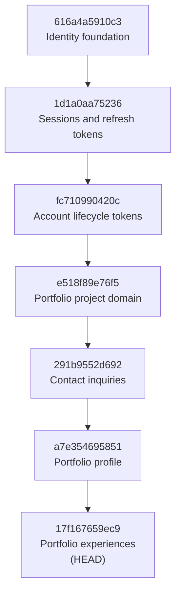

# Akahalu Portfolio — Database Migrations

## 1. Overview

Akahalu Portfolio uses Alembic to manage PostgreSQL schema evolution.

Migration files are stored under:

```text
backend/migrations/versions/
```

Configuration files:

```text
backend/alembic.ini
backend/migrations/env.py
```

Alembic obtains the effective database URL from application settings.

The placeholder value in `alembic.ini` is replaced at runtime by:

```text
settings.database_url
```

inside:

```text
backend/migrations/env.py
```

---

# 2. Current Migration Head

The current migration head is:

```text
17f167659ec9
```

The migration graph contains one branch and one head.



---

# 3. Revision History

## 3.1 `616a4a5910c3` — Identity foundation

File:

```text
616a4a5910c3_create_identity_foundation.py
```

Creates:

```text
permissions
roles
users
role_permissions
user_roles
```

Important characteristics include:

* UUID primary keys;
* timestamps;
* soft-deletion support;
* unique permission codes;
* unique role names;
* case-insensitive unique user emails;
* user-role many-to-many relationship;
* role-permission many-to-many relationship.

This is the base revision.

---

## 3.2 `1d1a0aa75236` — Authentication sessions and tokens

File:

```text
1d1a0aa75236_add_authentication_sessions_and_tokens.py
```

Creates:

```text
login_attempts
sessions
refresh_tokens
```

Important additions include:

* login-attempt history;
* device/session persistence;
* session expiration and revocation;
* refresh-token digests;
* refresh-token families;
* rotation lineage through `replaced_by_token_id`;
* relevant indexes for authentication lookups.

---

## 3.3 `fc710990420c` — Account lifecycle tokens

File:

```text
fc710990420c_add_account_lifecycle_tokens.py
```

Creates:

```text
email_verification_tokens
password_reset_tokens
```

Both tables support:

```text
token_digest
expires_at
consumed_at
revoked_at
```

and enforce:

```text
expires_at > created_at
```

User deletion cascades to these lifecycle-token records.

---

## 3.4 `e518f89e76f5` — Portfolio project domain

File:

```text
e518f89e76f5_add_portfolio_project_domain.py
```

Creates:

```text
project_categories
project_technologies
projects
project_links
project_media
project_technology_associations
```

Important schema features include:

* `CITEXT` names/slugs;
* publication and visibility constraints;
* category and technology relationships;
* project media;
* additional project links;
* ordered technology assignments;
* partial indexes;
* soft-deletion-aware unique constraints;
* one active primary media item per project.

---

## 3.5 `291b9552d692` — Contact inquiries

File:

```text
291b9552d692_add_contact_inquiries.py
```

Creates:

```text
contact_inquiries
```

Introduces:

* inquiry types;
* status lifecycle;
* priority;
* read state;
* assignment to users;
* optional project linkage;
* internal notes;
* consent state;
* source page and user-agent metadata;
* privacy-preserving IP hash;
* submission fingerprint;
* administrative listing indexes.

Database checks ensure state and timestamps remain consistent.

---

## 3.6 `a7e354695851` — Portfolio profile

File:

```text
a7e354695851_add_portfolio_profile.py
```

Creates:

```text
profiles
```

Adds profile permissions:

```text
profile.read
profile.create
profile.update
profile.delete
```

Important schema behavior includes:

* singleton `profile_key`;
* personal/professional profile content;
* availability state;
* public/private visibility;
* SEO fields;
* creator/updater audit references;
* public partial index.

---

## 3.7 `17f167659ec9` — Portfolio experiences

File:

```text
17f167659ec9_add_portfolio_experiences.py
```

Creates:

```text
experiences
```

Adds experience permissions:

```text
experience.read
experience.create
experience.update
experience.delete
```

Important constraints include:

* controlled employment types;
* controlled location types;
* chronological date validation;
* current positions cannot have an end date;
* featured records must be public;
* non-negative ordering;
* public/admin partial indexes.

This is the current Alembic head.

---

# 4. PostgreSQL Initialization

A new PostgreSQL database should have these extensions available:

```text
uuid-ossp
pgcrypto
citext
```

The Dockerized PostgreSQL environment initializes them from:

```text
infrastructure/postgres/init.sql
```

The script uses:

```sql
CREATE EXTENSION IF NOT EXISTS
```

so repeated extension creation attempts are safe.

---

# 5. Migration Configuration

`backend/migrations/env.py` imports:

```text
app.core.config.settings
app.db.model_registry.Base
```

The runtime migration URL is set with:

```python
config.set_main_option(
    "sqlalchemy.url",
    settings.database_url.replace("%", "%%"),
)
```

This means environment configuration, rather than a hard-coded production URL, determines the migration target.

---

# 6. Metadata Registration

Alembic uses:

```text
Base.metadata
```

from:

```text
app.db.model_registry
```

The model registry must import every model that belongs to the database schema.

When adding a new model, failure to register it can cause:

* missing autogenerate changes;
* incomplete metadata comparisons;
* missing tables during metadata-driven tests.

Therefore a new database entity requires both:

```text
model definition
+
model-registry registration
```

before migration generation.

---

# 7. Creating a New Migration

From:

```text
backend/
```

run:

```powershell
uv run alembic revision `
    --autogenerate `
    -m "describe schema change"
```

Example:

```powershell
uv run alembic revision `
    --autogenerate `
    -m "add portfolio certifications"
```

The generated migration must be manually reviewed.

Autogeneration is a starting point, not a substitute for migration review.

---

# 8. Migration Review Checklist

Before applying a new migration, inspect:

1. `revision`
2. `down_revision`
3. newly created tables;
4. deleted tables;
5. new columns;
6. removed columns;
7. nullability changes;
8. defaults;
9. indexes;
10. foreign-key actions;
11. unique constraints;
12. check constraints;
13. data migrations;
14. downgrade behavior.

Pay particular attention to destructive operations such as:

```text
DROP TABLE
DROP COLUMN
changing nullable → non-nullable
changing data types
new unique constraints on existing data
```

---

# 9. Verify Migration Heads

Run:

```powershell
uv run alembic heads
```

Expected current output:

```text
17f167659ec9 (head)
```

The repository CI expects exactly one Alembic head.

Multiple heads indicate migration-branch divergence that must be resolved before merge/deployment.

---

# 10. Inspect Migration History

Run:

```powershell
uv run alembic history
```

The expected current chain is:

```text
a7e354695851 -> 17f167659ec9 (head)
291b9552d692 -> a7e354695851
e518f89e76f5 -> 291b9552d692
fc710990420c -> e518f89e76f5
1d1a0aa75236 -> fc710990420c
616a4a5910c3 -> 1d1a0aa75236
<base> -> 616a4a5910c3
```

---

# 11. Apply All Migrations

From the backend directory:

```powershell
uv run alembic upgrade head
```

This is the standard migration command for:

* local development;
* CI migration verification;
* production deployment migration jobs.

---

# 12. Check Current Database Revision

Run:

```powershell
uv run alembic current
```

A fully migrated database should report the current head.

At the time of this document:

```text
17f167659ec9 (head)
```

---

# 13. Downgrades

Individual migrations currently provide downgrade implementations.

A development downgrade can be executed with:

```powershell
uv run alembic downgrade -1
```

or to a specific revision:

```powershell
uv run alembic downgrade <revision>
```

Downgrades may remove:

* tables;
* indexes;
* permissions inserted by migrations;
* dependent schema data.

They should therefore be used carefully whenever persistent data exists.

Production recovery should not assume every schema downgrade is operationally harmless merely because a `downgrade()` function exists.

---

# 14. Fresh Database Procedure

For a fresh environment:

```text
1. PostgreSQL starts
2. Required PostgreSQL extensions are initialized
3. Alembic applies all revisions to head
4. Identity bootstrap synchronizes current roles and permissions
5. Backend starts
```

Production Compose implements the migration portion as a separate one-time service.

Conceptually:

```text
PostgreSQL healthy
       ↓
alembic upgrade head
       ↓
identity bootstrap
       ↓
FastAPI
```

Migrations are not run independently by every Uvicorn worker.

---

# 15. Identity Bootstrap After Migration

Schema migration and application identity synchronization are separate responsibilities.

After migration:

```powershell
python -m scripts.seed_identity --skip-admin
```

synchronizes the current:

```text
permissions
system roles
role-permission assignments
```

The current identity catalogue contains 17 permissions and the system roles:

```text
super_admin
admin
editor
viewer
```

The first administrator is created separately rather than being hard-coded into the deployment configuration.

---

# 16. Portfolio Seed Policy

Portfolio content seeding is separate from database migration.

The presence of:

```text
backend/scripts/seed_portfolio.py
```

does not make portfolio content part of schema deployment.

Production startup should not automatically publish development/personal seed content.

---

# 17. CI Migration Validation

Backend CI performs migration-specific validation.

The workflow verifies:

```text
one Alembic head
```

and applies:

```text
alembic upgrade head
```

against a fresh PostgreSQL 17 service database before running the full backend test suite.

This catches problems including:

* broken revision chains;
* missing PostgreSQL extensions;
* invalid DDL;
* foreign-key ordering problems;
* migration/runtime model incompatibility.

---

# 18. Test Database vs Migration Database

The integration-test fixture and migration test serve different purposes.

## Integration-test fixture

The test fixture uses SQLAlchemy metadata to:

```text
drop tables
create required citext extension
create tables from Base.metadata
run tests
drop tables
```

This validates current model behavior.

## Alembic CI migration step

The CI migration step starts with a fresh PostgreSQL schema and runs:

```text
alembic upgrade head
```

This validates historical schema evolution.

Both checks are valuable because a model can be correct while the migration chain is broken, or vice versa.

---

# 19. Production Migration Safety

Before deploying a migration that can alter existing production data:

1. review the generated DDL;
2. confirm the migration chain has one head;
3. run backend CI;
4. apply the migration against a disposable/fresh database;
5. test against representative data where the migration transforms existing records;
6. back up production data before destructive schema changes;
7. run the migration as a controlled deployment job;
8. confirm the resulting revision;
9. verify application readiness after migration.

---

# 20. Destructive Changes

Changes that require additional care include:

```text
column deletion
table deletion
type conversion
foreign-key behavior changes
new unique constraints
making nullable columns mandatory
data rewrites
permission-removal migrations
```

Where practical, production schema changes should favor backward-compatible phased migrations.

For example:

```text
add nullable column
    ↓
deploy compatible application
    ↓
backfill data
    ↓
enforce stricter constraint later
```

rather than combining every compatibility-breaking change into one deployment.

---

# 21. Permission Data in Migrations

Some schema revisions also insert permissions required by the domain introduced by the migration.

Examples include:

```text
profile permissions
experience permissions
```

Their downgrade functions remove the corresponding role-permission assignments before deleting the permission records.

The current canonical permission catalogue is still synchronized by the identity bootstrap.

Therefore:

```text
migration data
```

and:

```text
identity bootstrap state
```

must remain compatible.

---

# 22. Migration File Rules

Migration files already applied to shared or production-like environments should generally be treated as immutable history.

New schema changes should normally be represented by new revisions rather than editing an old applied revision.

This preserves reproducibility from:

```text
<base>
```

to:

```text
head
```

---

# 23. Recommended Validation Commands

From:

```text
backend/
```

run:

```powershell
uv run alembic heads
```

then:

```powershell
uv run alembic history
```

then:

```powershell
uv run ruff check app scripts tests
```

then:

```powershell
uv run mypy app scripts tests
```

then:

```powershell
uv run pytest -q
```

For a fresh migration target:

```powershell
uv run alembic upgrade head
```

---

# 24. Current Migration Status

Current validated state:

```text
Migration revisions: 7
Migration branches:  1
Migration heads:     1
Current head:        17f167659ec9
Database engine:     PostgreSQL
```

The complete migration chain has been successfully applied against a fresh PostgreSQL production-stack database and through the remote Backend CI workflow.

---

# 25. Migration Design Principles

Future database work should preserve these rules:

1. Every schema change receives an Alembic revision.
2. The migration graph should normally retain one head.
3. Autogenerated revisions must be reviewed.
4. Model registration must be complete before autogeneration.
5. Production secrets must not appear in migration files.
6. Migrations obtain connection information from environment-backed settings.
7. Schema migrations and content seeding remain separate.
8. Migrations execute before production application traffic is accepted.
9. Destructive operations require explicit review and backup planning.
10. CI must continue validating a fresh migration to head.
